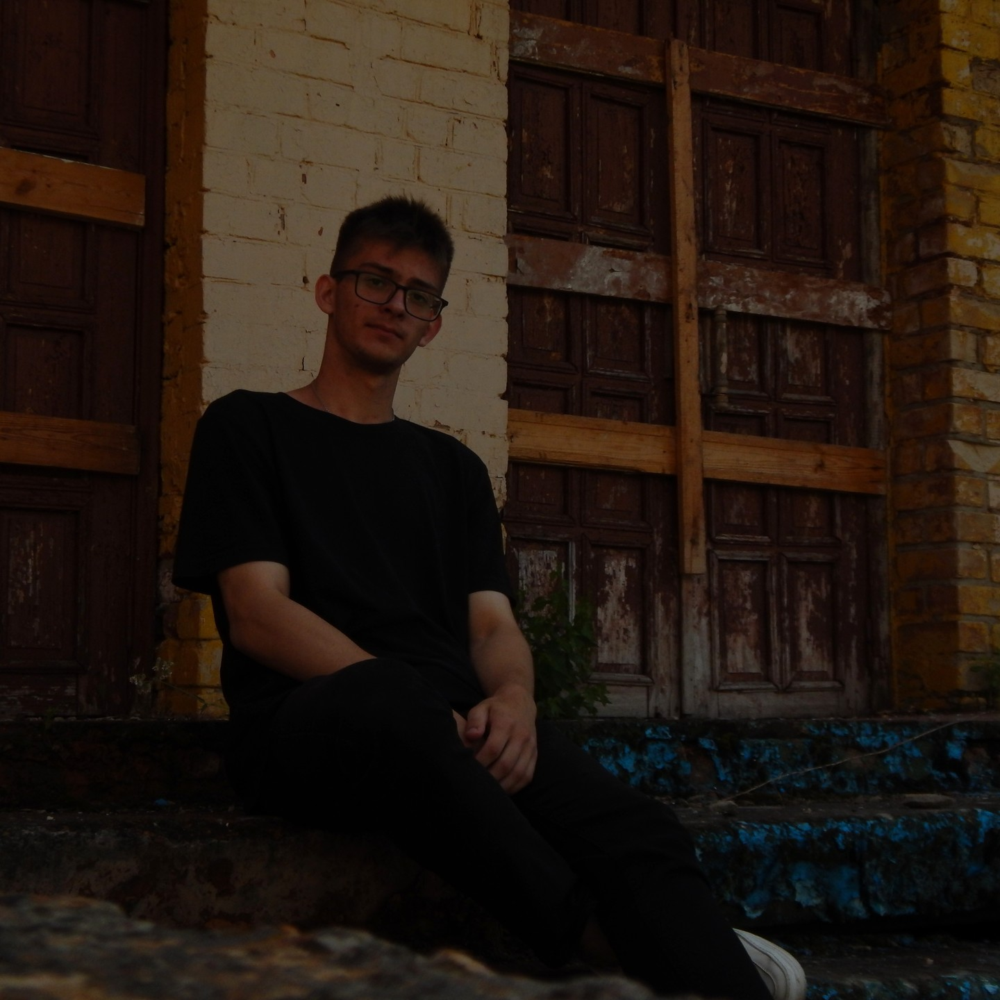

# Curriculum vitae

## Sugak Stanislav

        

#### A cheerful, purposeful and persevering person. In addition to programming, I am engaged in drawing and photography. I'm learning video editing and animation. He is self-disciplined in his studies and personal projects. I study several programming languages from scratch on my own and help others.

## LANGUAGE               
+ English
+ Russian
                                
## CONTACT
+ MTC Belarus: +375(33) 613-76-41
+ [Stanislav71492584](https://mail.google.com/mail/u/0/#inbox "My gmail.com")
+ [@Stasi4ekKk](https://web.telegram.org/k/#@Stasi4ekKk "My telegram")

